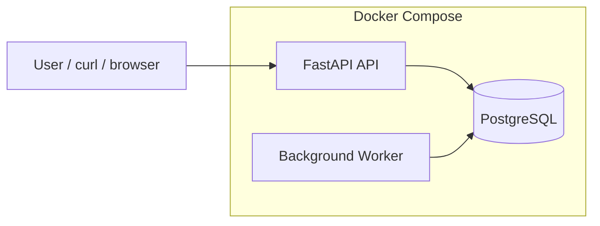

# Infra Uptime Monitor

A small SRE-flavoured uptime monitor for **URLs and IP-based targets**.  
Built to be **boring, predictable and reproducible**.

> Current state: API + DB + background worker  
> Features: HTTP/TCP checks, retention, Docker Compose

---

## What it does

- Stores monitoring targets in PostgreSQL
- Supports target types:
  - `http` (URL availability)
  - `tcp` (port availability)
  - `icmp` (ping – planned)
- Exposes a simple REST API
- Uses **Alembic migrations** for database schema management
- Runs fully locally via **Docker Compose**
- Background worker performing periodic checks
- Stores check results (status, latency, errors)
- Retention policy for old check data

---

## Architecture



---

## Quickstart (local)

### Requirements
- Docker Desktop

### Run

```bash
docker compose up --build
```

API endpoints:
- Health check: http://localhost:8000/healthz
- Swagger UI: http://localhost:8000/docs

Stop:

```bash
Ctrl + C
```

Run in background:

```bash
docker compose up -d
docker compose logs -f
docker compose down
```

---

## Configuration

Create a `.env` file (not committed, see `.env.example`):

```env
APP_ENV=dev
DATABASE_URL=postgresql+psycopg2://postgres:postgres@db:5432/uptime
WORKER_INTERVAL_SECONDS=30
WORKER_HTTP_TIMEOUT_SECONDS=5
WORKER_TCP_TIMEOUT_SECONDS=3
CHECK_RETENTION_DAYS=7
```

---

## API usage

### Create monitoring target

```bash
curl -X POST http://localhost:8000/targets \
  -H "Content-Type: application/json" \
  -d '{
    "name": "Google",
    "type": "http",
    "target": "https://google.com",
    "enabled": true
  }'
```

### List targets

```bash
curl http://localhost:8000/targets
```

---

## Database migrations

Database schema is managed via **Alembic**.

Migrations are executed automatically when the API container starts:

```bash
alembic upgrade head && uvicorn ...
```

Manual commands (inside running container):

```bash
docker compose exec api alembic current
docker compose exec api alembic history
docker compose exec api alembic upgrade head
```

---

## Why this project

I’m transitioning from a networking-heavy background towards  
**SRE / platform engineering**.

This project focuses on:
- availability & monitoring mindset
- reproducible environments
- explicit database schema management
- clean separation between API and future worker logic

---

## Roadmap

- Background worker performing checks (done)
- HTTP and TCP monitoring (done)
- Store check results (status, latency, timestamp) (done)
- Data retention policy (done)
- Uptime history & simple status view
- Alerting (webhook / email)
- Kubernetes deployment (k3s-friendly)
- Optional Terraform cloud deployment

---

## License

MIT